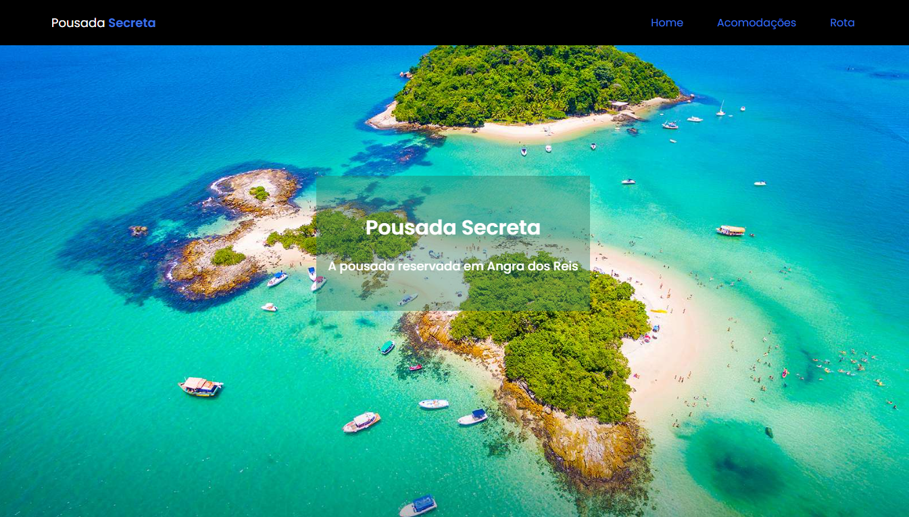

# Pousada Secreta

## Tecnologia: 

## Pousada Secreta, é um web site bem interativo de uma pousada ficticia em Angra dos Reis, a pagina conta com rotas de navegação entre paginas e links de acesso, telefone, reserva, endereço. Totalmente responsiva e com um designer se chama a atenção do usuario.

## Confira o Deploy da pagina: https://pousadasecreta-angradosreis.netlify.app/

### Objetivo:
- Criar uma pagina web.
- Utilizar a biblioteca React Router Dom.
- Reaproveitar componentes via Props.
- Responsivo para qualquer tamanho de tela.

### Oque aprendi.
- Apliquei o conhecimento que já tenho para desenvolver a pagina, e buscando sempre aprimorar e melhorar, de forma a construir o site cada vez mais rapido e com mais conteudo.

### 
### 
### 
### 
### 
### 